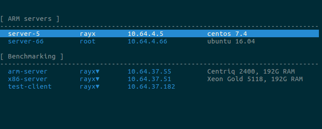
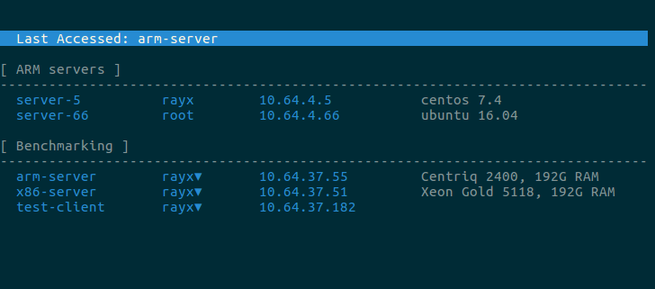
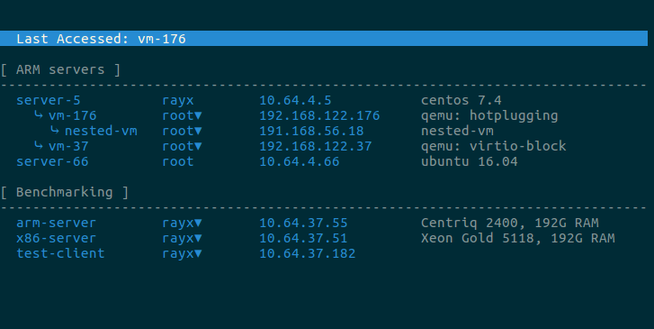
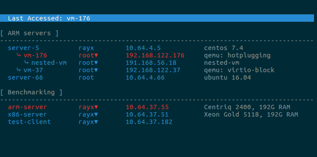

A simple SSH host manager in terminal.

# Introduction

Pickhost allows you to define SSH login information (e.g., host, user, comments, etc.) in an simple INI style config file and select a host in an interactive way in terminal. It's implemented using PyPick.

Compared to existing SSH managers (as far as I know, all of them are GUI applications), pickhost is simple to config and quick to launch. It's non-disruptive and integrates with your workflow well if you spend most of your time in terminal.

The following is an example screenshot:

# Install

As Python2 will be EOL'ed soon, PyPick supports only Python3. To install it, run:

    $ python3 -m pip install pickhost

# A Quick-Start Guide

## A Simple Example

To use pickhost, you need to add your hosts to its config file. The config file is located at $HOME/.config/pickhost/hosts by default. Or you can specify a custom config file using -f option if you like. Config file is of INI format. You can edit it with any editor you like. Pickhost provides a convenient option -e, which opens the file using editor specified by EDITOR environment variable or vi if it's not set.

    $ pickhost -e
	
Add the following to the file:

    [ARM servers]
    server-5 = rayx@10.64.4.5 #centos 7.4
    server-66 = root@10.64.4.66 #ubuntu 16.04
    
    [Benchmarking]
    arm-server = rayx,root@10.64.37.55 #Centriq 2400, 192G RAM
    x86-server = rayx,root@10.64.37.51 #Xeon Gold 5118, 192G RAM
    test-client = rayx,root@10.64.37.182

The file contains multiple sections. This is not mandatory and you can add hosts to the file without using section. That said, it's recommended to group your hosts in sections because it helps to identify your host quickly.

Except section header, each line in the file describes a host in this format:

    <name> = <users>@<host> #<comment>

- 'name' is a string you'd like to call the host. It mustn't have any of these characters: '=', '@', '#'.
- 'users' is a comma separated list. The first value in the list is displayed by default. You can go through other availale values by pressing 'u'.
- 'host' is the host to be ssh'ed into. It can be any valid hostname accepted by SSH client on your machine. For example, it can be IP address, short hostname, FQDN, or a hostname translated by SSH client (see 'HostName' option in ssh_config(5) man page).
- 'comment' is an arbitrary string. It provides additional information about the host, like what project it's used for, its configuration, etc.

The above configuration generates a list like the following. Note that there is a small triangle '▾' after user name in some entries. That indicates there are multiple available user name values and you can press 'u' to go through them.

You can press 'UP' and 'DOWN' (or VI style 'j' and 'k') to navigate through items in the list, press 'ENTER' (or 'SPACE') to select an entry, or press 'ESC' (or 'q') to quit without selecting anyting. 

Now suppose you navigate to the first entry in 'Benchmarking' section. Press 'u' once to change user name from 'rayx' to 'root', then press 'ENTER'. Pickhost would print the following on stderr:

    $ pickhost
    export PH_USER=root
    export PH_HOST=10.64.37.55
    export PH_NAME=arm-server

That's pretty much it for this section. Next we'll talk about how to use the above output in shell script and a few more useful features of pickhost.

## Processing Pickhost Output in Shell Script

Pickhost command output is expected to be consumed by shell script. Below is an example code on how to do that:

    function pick {
        unset PH_NAME PH_USER PH_HOST
        eval $(pickhost 2>&1 >/dev/tty)
        # Return if no entry is selected.
        [[ -n $PH_NAME ]] || return 0
        echo "Logging into ${PH_NAME}..."
        ssh ${PH_USER}@${PH_HOST}
    }

If you want to use pickhost in your Python program, you can instantiate the PickHost class in pickhost module. That is out of the scope of this tutorial, so please refer to the code.

## Last Accessed Host

Now you have run pickhost for the first time and selected an entry. If you try it again, the list changes a bit:

Note there is a 'last accessed' entry at the top of the list, which contains the entry you selected last time. You just need to press 'ENTER' to start a new login session. This is useful feature to save a lot of key press in a busy work day.

## Parent/Child Relationship among Hosts

You can define parent/child relationship between hosts. This is particularly useful when you need to deal with VMs in your work. Below is an example config file:

    [ARM servers]
    server-5 = rayx@10.64.4.5 #centos 7.4
    server-5->vm-176 = root,rayx@192.168.122.176 #qemu: hotplugging
    server-5->vm-176->nested-vm = root,rayx@191.168.56.18 #nested-vm
    server-5->vm-37 = root,rayx@192.168.122.37 #qemu: virtio-block
    server-66 = root@10.64.4.66 #ubuntu 16.04
    
    [Benchmarking]
    arm-server = rayx,root@10.64.37.55 #Centriq 2400, 192G RAM
    x86-server = rayx,root@10.64.37.51 #Xeon Gold 5118, 192G RAM
    test-client = rayx,root@10.64.37.182
	
As you may notice, a child host's name containing all its ancestor names, separated by '->'. The config file generates a list like the following, which shows the relationship visually and helps you to identify a VM quickly.

You don't need to keep the entrys in correct order. For example, the config file below generates the same list:

    [ARM servers]
    server-5 = rayx@10.64.4.5 #centos 7.4
    server-66 = root@10.64.4.66 #ubuntu 16.04
    server-5->vm-176 = root,rayx@192.168.122.176 #qemu: hotplugging
    server-5->vm-37 = root,rayx@192.168.122.37 #qemu: virtio-block
    server-5->vm-176->nested-vm = root,rayx@191.168.56.18 #nested-vm
    
    [Benchmarking]
    arm-server = rayx,root@10.64.37.55 #Centriq 2400, 192G RAM
    x86-server = rayx,root@10.64.37.51 #Xeon Gold 5118, 192G RAM
    test-client = rayx,root@10.64.37.182

## Highlighting a Host

Among all hosts in a list, there are usually a few ones which you access frequently. For those hosts, you may want to highlight them so that you can quickly identify them. This is particularly useful if you have a long list.

You can highlight an entry by adding '!' character after the host name. Below is an example:

    [ARM servers]
    server-5 = rayx@10.64.4.5 #centos 7.4
    server-5->vm-176! = root,rayx@192.168.122.176 #qemu: hotplugging
    server-5->vm-176->nested-vm = root,rayx@191.168.56.18 #nested-vm
    server-5->vm-37 = root,rayx@192.168.122.37 #qemu: virtio-block
    server-66 = root@10.64.4.66 #ubuntu 16.04
    
    [Benchmarking]
    arm-server! = rayx,root@10.64.37.55 #Centriq 2400, 192G RAM
    x86-server = rayx,root@10.64.37.51 #Xeon Gold 5118, 192G RAM
    test-client = rayx,root@10.64.37.182
	
It generates a list like this:

# Manual

     $ pickhost -h
    usage: pickhost [-h] [-f file] [-e]
    
    optional arguments:
      -h, --help  show this help message and exit
      -f file     config file
      -e          edit config file rather than show it

# TODO

- Allow user to set theme (e.g., width and color of the columns)
